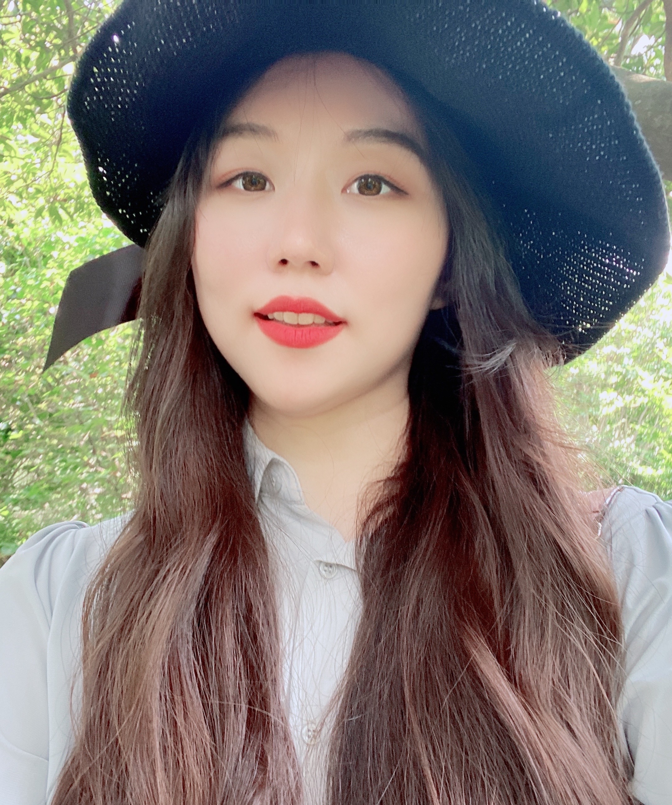

# Hannah Lee
I pay attention to attention, mostly being the most distracted person in one sitting/setting.

 <!-- Updated link to match the uploaded file -->

## About Me

I am currently a research assistant at NYU Langone and Columbia NYSPI, where I work on projects exploring the neural basis of visual perception and perceptual decision.

### Research Interests

My research interests focus on the biological foundations of visual perception and attention, particularly how these visual judgments shape decision-making processes. I am especially interested in how different regions within traditional and non-traditional visual pathways contribute to perception, and how they adapt to compensate for damage or loss.

### Contact Information

- [e-mail](mailto:hl4693@nyu.edu)
- [ResearchGate](https://www.researchgate.net/profile/Hyun-Seo-Lee-3)
- [LinkedIn](https://www.linkedin.com/in/hannah-lee-742711287/)
- [GitHub](https://github.com/HANNAH-LEE-LY)
- [Google Scholar](https://scholar.google.com/citations?hl=en&user=nXO2LRAAAAAJ)

---

Along with my academic journey I mostly walk with Paul Neruda, Mary Oliver, Toni Morrison, Marc Chagall, Guillermo del Toro, and Brahms
